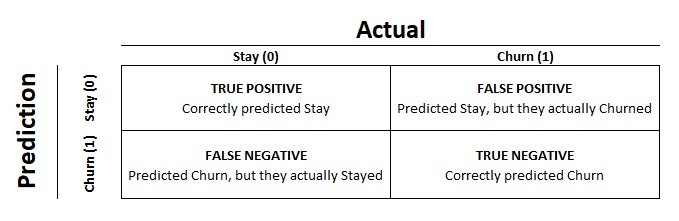
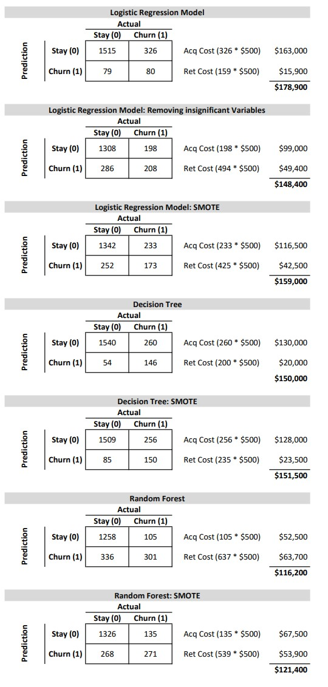

```{r setup, include=FALSE}
knitr::opts_chunk$set(echo = TRUE,warning = FALSE, message = FALSE)
```

## Introduction

This is the final project for the HarvardX PH125.9x - Data Science: Capstone class.


## Delivering Insights about Customers

The key to business is a happy customer. The ability to generate recurring revenue is key. We will attempt to gain some insights into why customers may leave us (aka attrition or churn). This may provide benefits like (1) how to retain them, (2) basis for better revenue forecasting, or (3) designing performance incentives on attracting more profitable customers. 

In this exercise we are working towards maximizing True Negative predictions, customers that did leave, while minimizing False Positives, or customers that did leave, but we missed in our algorithm.

## Data Definitions

Our data contains 10,000 observations and 14 variables.

**RowNumber** --- Corresponds to the record (row) number and has no effect on the output.

**CustomerId** --- Contains random values and has no effect on customer leaving.

**Surname** --- The surname of a customer has no impact on their decision to leave.

**CreditScore** --- Can have an effect on customer churn, since a customer with a lower credit score is more likely to leave.

**Geography** --- A customer's location can affect their decision to leave.

**Gender** --- Does gender play a role? Let's explore and see.

**Age** --- Younger customers are more likely to leave their bank than older.

**Tenure** --- The number of years that the customer has been a client. Intuitively, longer tenure means more loyal and less likely to leave.

**Balance** --- A good indicator of customer churn, as people with a higher balance in their accounts are less likely to leave compared to those with lower balances.

**NumOfProducts** --- The number of products that a customer has in their total relationship with the bank.

**HasCrCard** --- Does the customer have a credit card? This column is important since people with a credit card are less likely to leave.

**IsActiveMember** --- Active customers are less likely to leave.

**EstimatedSalary** --- Customers with higher salaries are more likely to stay compared to those with lower salaries.

**Exited** --- Has the customer left?

```{r echo=FALSE, include=FALSE}
#Check/Install packages if necessary
if (!require("readr")) install.packages("readr")
if (!require("caret")) install.packages("caret")
if (!require("rpart")) install.packages("rpart")
if (!require("ggplot2")) install.packages("ggplot2")
if (!require("dplyr")) install.packages("dplyr")
if (!require("tidyr")) install.packages("tidyr")
if (!require("performanceEstimation")) install.packages("performanceEstimation") #used for SMOTE
if (!require("fastDummies")) install.packages("fastDummies") #used for one hot encoding
if (!require("ROCR")) install.packages("ROCR")
if (!require("rpart.plot")) install.packages("rpart.plot")
if (!require("randomForest")) install.packages("randomForest")
#Load libraries
library(readr)
library(caret)
library(rpart)
library(ggplot2)
library(dplyr)
library(tidyr)
library(performanceEstimation)
library(gridExtra)
library(ROCR)
library(rpart.plot)
library(randomForest)

#Turn off Scientific Notation
options(scipen=999)
#set seed to replicate results
set.seed(1) 

#Download the file from the URL below
#https://www.kaggle.com/datasets/shantanudhakadd/bank-customer-churn-prediction?resource=download

#read the csv.
#Update the path for your directory
data <- read_csv("C:\\Users\\b010dxw\\projects\\Capstone\\Churn_Modelling.csv")
```

Let's take a look at a glimpse of the data together

```{r echo=FALSE}
glimpse(data)
```

## Exploring Data and Analyzing is the First Step to Understanding

The overall proportion of customers who have churned in our data set is approximately 20%. If we didn't know anything at all and just guessed that the majority of our customer's stayed with us we would be right 80% of the time!

```{r echo=FALSE}
ggplot(data,  aes(x= Exited)) +
  geom_bar() + #add bars
  scale_x_discrete(labels=c('Stayed', 'Exited'))+ #Change the x axis labels from 0,1 to text
  #geom_text(aes(label = ..count..), stat = "count", vjust = 1.5, colour = "white")+ #Adds data labels
  geom_text(aes(label=scales::percent(after_stat(prop)), group=1),stat="count", vjust=1.5, colour = "white")+ # shows %
  labs(title="Proportion of Customers that Stayed vs Exited (Churned)",x="",y="# of Customers")+ #Adds title and axis labels
  theme(plot.title = element_text(hjust = 0.5)) #Centers Title
```

### Visual Insights of our Categorical Data

The churn rate for customers in Germany are over 2x that of other countries.

```{r echo=FALSE, fig.width=10}
#Churn by Geography
ggplot(data,  aes(Geography,fill = factor(Exited))) +
  geom_bar(position = 'dodge') +
  geom_text(aes(label=scales::comma(after_stat(count))),position = position_dodge(width=1), vjust=-1.2, stat="count")+
  geom_text(aes(label= scales::percent(after_stat(prop)), group=1),stat="count") + # shows %
  labs(title="Churn by Geography",y="# of Customers")+
  scale_fill_discrete(name = "Exited", labels = c("Stayed", "Churned")) +
  theme(plot.title = element_text(hjust = 0.5)) #Centers Title
```


The Male category churn is \~16% (or 44% of total churn) vs the female category churn is \~25% churn (or 56% of total churn)

```{r echo=FALSE, fig.width=10}
#Churn by Gender
ggplot(data,  aes(Gender,fill = as.factor(Exited))) +
  geom_bar(position = 'dodge') +
  geom_text(aes(label= scales::comma(after_stat(count))),position = position_dodge(width=1), vjust=-1.2, stat="count" )+
  geom_text(aes(label= scales::percent(after_stat(prop)), group=1),stat="count") + # shows %
  labs(title="Churn by Gender",x="Gender",y="# of Customers")+ #custom titles
  #  theme(legend.position = "bottom")+ #place legend on bottom
  scale_fill_discrete(name = "Exited", labels = c("Stayed", "Churned")) +
  theme(plot.title = element_text(hjust = 0.5)) #Centers Title
```


```{r echo=FALSE, fig.width=10}
#Churn by HasCrCard
ggplot(data,  aes(factor(HasCrCard),fill = factor(Exited))) +
  geom_bar(position = 'dodge') +
  scale_x_discrete(labels=c('No Credit Card', 'Has Credit Card'))+ #Change the x axis labels from 0,1 to text
  geom_text(aes(label=scales::comma(after_stat(count))),position = position_dodge(width=1), vjust=-1.2, stat="count")+
  geom_text(aes(label=scales::percent(after_stat(prop)), group=1), stat="count")+
  labs(title="Churn by HasCrCard",x="HasCrCard",y="# of Customers")+
  scale_fill_discrete(name = "Exited", labels = c("Stayed", "Churned")) +
  theme(plot.title = element_text(hjust = 0.5)) #Centers Title
```

It seems that whether a specific customer has a credit card or not does not matter because the propensity to churn is proportionally even.


```{r echo=FALSE, fig.width=10}
#Churn by Inactive/Active Status (IsActiveMember)
ggplot(data,  aes(factor(IsActiveMember),fill = factor(Exited))) +
  geom_bar(position = 'dodge') +
  scale_x_discrete(labels=c('Inactive', 'Active')) + #Change the x axis labels from 0,1 to text
  geom_text(aes(label=scales::comma(after_stat(count))),position = position_dodge(width=1), vjust=-1.2,stat="count")+
  geom_text(aes(label=scales::percent(after_stat(prop)), group=1),stat="count")+
  labs(title="Churn by Inactive vs Active Status",x="IsActiveMember",y="# of Customers")+
  scale_fill_discrete(name = "Exited", labels = c("Stayed", "Churned")) +
  theme(plot.title = element_text(hjust = 0.5)) #Centers Title
```

Inactive customers have a higher propensity to churn than Active with Active customers being slightly larger at 51.5% of the total population.


```{r echo=FALSE, fig.width=10}
#Churn by Tenure
ggplot(data,  aes(factor(Tenure),fill = factor(Exited))) +
  geom_bar() +
  coord_flip()+
  labs(title="Churn by Tenure",x="Tenure",y="# of Customers")+
  scale_fill_discrete(name = "Exited", labels = c("Stayed", "Churned")) +
  theme(plot.title = element_text(hjust = 0.5)) #Centers Title
```

Tenure of 0 and 10 have the lowest churn, while 1 through 9 are similar and relatively flat.

```{r echo=FALSE, fig.width=10}
#Churn by Age
ggplot(data,  aes(factor(Age),fill = factor(Exited))) +
  geom_bar() +
  labs(title="Churn by Age",x="Age",y="# of Customers")+
  scale_x_discrete(guide = guide_axis(check.overlap = TRUE))+
  scale_fill_discrete(name = "Exited", labels = c("Stayed", "Churned")) +
  theme(plot.title = element_text(hjust = 0.5)) #Centers Title
```

Customers in the age range of 48 and older churn more as a proportion of total.

### Reviewing and Identifying Potential Outliers

```{r echo=FALSE, fig.width=10}
a1<-ggplot(data,  aes(x= Age)) +
  geom_boxplot() +
  labs(title="Age")+
  theme(plot.title = element_text(hjust = 0.5)) #Centers Title

a2<-ggplot(data,  aes(x= Balance)) +
  geom_boxplot() +
  labs(title="Balance")+
  theme(plot.title = element_text(hjust = 0.5)) #Centers Title

a3<-ggplot(data,  aes(x= CreditScore)) +
  geom_boxplot() +
  labs(title="CreditScore")+
  theme(plot.title = element_text(hjust = 0.5)) #Centers Title

a4<-ggplot(data,  aes(x= EstimatedSalary)) +
  geom_boxplot() +
  labs(title="EstimatedSalary")+
  theme(plot.title = element_text(hjust = 0.5)) #Centers Title

grid.arrange(a1,a2,a3,a4)
rm(a1,a2,a3,a4)

```
In reviewing Age, Credit Score, Balance, and Estimated Salary, we can identify that Age and Credit Score have outliers that in turn may impact our results.

## Pre-processing of Data

Shown below is a descriptive view of our data

```{r echo=FALSE}
str(data)
```

Summary of the variables.\

We need to check for data quality, nulls, N/As, blanks, and duplicates. There are no N/As or nulls in the summary so we can move forward.

```{r echo=FALSE}
summary(data)
```

We now check for duplicates

```{r echo=FALSE}
#checking for duplicates
data%>%duplicated()%>%which()  

```

Next, we need to check for columns that are not needed. If the count of unique values is 1, this indicates that there isn't much variation or all the values in the column are constant. These types of columns don't help in predicting the output, so we remove them from the data set. If the count is equal to the number of records then it could negatively impact our model. RowNumber and CustomerID fall in to this scenario. Also, Surname should be removed.

```{r echo=FALSE}
sapply(data, function(x) n_distinct(x))
data <- subset(data, select = -c(CustomerId,Surname,RowNumber)) #remove columns
```

### Adjusting the scale for continuous variables.

Standardization becomes important when continuous independent variables are measured at different scales. These variables do not give equal contribution when analyzing the data. The customer segmentation analysis we are performing is attempting to group customers based on their homogeneous attributes. A variable called 'transaction amount' that ranges between \$100 and \$10,000 carries more weighting than 'number of transactions' in a range between 0 and 40. Therefore, we must transform the data to comparable scales to compensate for this. The idea is to re-scale an original variable to have equal (i.e. comparable) range and/or variance.

```{r}
data$Age = scale(data$Age)
data$CreditScore = scale(data$CreditScore)
data$Balance = scale(data$Balance)
data$EstimatedSalary = scale(data$EstimatedSalary)
data$Tenure = scale(data$Tenure)
```

Converting categorical variables to factors is needed for our models to work by cleaning up the data and converting to usable data types.

```{r}
data$Geography <-factor(data$Geography)
data$Gender <-factor(data$Gender)
data$HasCrCard <-factor(data$HasCrCard)
data$IsActiveMember <-factor(data$IsActiveMember)
data$ExitedFactor <-data$Exited
data$ExitedFactor <-factor(data$ExitedFactor) 
```

Convert Categorical Variables to dummys

```{r}
data = dummy_cols(data,
           select_columns = c("Gender","Geography","HasCrCard","IsActiveMember"),
           remove_selected_columns = TRUE,
           remove_first_dummy = TRUE)
#rename y variable
#data <- data %>%  rename("Exited" = "Exited_1")
```

Check our results to make sure all pre-processing is as desired.

```{r}
summary(data)
str(data)
```

### Split Data for Training and Test Purposes

Our training data set = 80% and test set = 20% of the total population.

```{r}
 trainIndex <- createDataPartition(data$Exited, p = 0.8, list = FALSE, times = 1)
 train <- data[ trainIndex,]
 test  <- data[-trainIndex,]
 rm(trainIndex)
```

Splitting helps to smooth out our data when it is imbalanced.

```{r}
 data.frame(table(train$Exited))
```

If we try the split again but use a different technique it might help to further balance our data set. The SMOTE (Synthetic Minority Oversampling Technique) helps to correct the imbalance. The train and train_smote data sets will be used for the different models in our evaluation.

The SMOTE technique results show our Stayed(0) and Churn (1) is more balanced.

```{r}
train_smote <- smote(ExitedFactor ~.,train, perc.over =20, perc.under =1  )
 data.frame(table(train_smote$Exited)) 
  data.frame(table(test$Exited)) 
```

```{r echo=FALSE}
#optional to remove and save space
rm(data)
rm(datacopy)
```

## Modeling Approaches to Drive Better Predictions

Our analysis will take into account the performance of the following models: 
(1) Generalized Linear, (2) Decisions Tree, and (3) Random Forest.

Finding the balance between false negatives and false positives is key. A false negative would be customers who would not churn that our models picked up and a false positive would be customers who would churn that our models missed. This becomes extremely important when attempting to forecast the financial impact of the efforts of retaining an existing customer vs the cost of acquiring new customers. We will look at a real world example later on to demonstrate this.

### Model 1: Logistic Regression Model

We chose the binomial family for GLM because it is generally best for binary data, such as 0 & 1, which is our y value.

In order to achieve the maximum sensitivity and specificity we will use a cutoff of 0.5.

```{r echo=FALSE}
LR_model <- glm(ExitedFactor ~ .-Exited,
                 data = train,
                 family=binomial)
summary(LR_model)
glm_pred <- predict(LR_model,test)
cutoff <- ifelse(glm_pred>=0.0, 1,0)

confusionMatrix(as.factor(cutoff),test$ExitedFactor
                ,positive ='1'
                ,mode="everything")
LR_CM<-data.frame(Logistic=confusionMatrix(as.factor(cutoff),test$ExitedFactor
                                                    ,positive ='1'
                                                    ,mode="everything")$byClass)
 #optional remove components to save space
 rm(LR_Model)
 rm(glm_pred)
 rm(cutoff)
```

Our P Values show that not all of the variables are statistically significant.

Unfortunately, our results show 80% accuracy, which is what we would also achieve if we choose all customers were not to churn. We correctly classified 80 customers who will churn and missed 326 making our recall 19.7%. We will attempt to provide better results going forward.

### Logistic Regression Model: Removing insignificant Variables

Let's see what the results show if we tailor our cutoff to favor recall and run the model again excluding CreditScore, Tenure, Estimate Salary, and Spain.

```{r echo=FALSE}
 LR_model <- glm(Exited ~ .-CreditScore-Tenure-EstimatedSalary-Geography_Spain-HasCrCard_1-ExitedFactor,
                  data = train,
                  family=binomial)
 summary(LR_model)
 glm_pred <- predict(LR_model,test)
 cutoff <- ifelse(glm_pred>=-1.0, 1,0)
 confusionMatrix(as.factor(cutoff),test$ExitedFactor
                 ,positive ='1'
                 ,mode="everything")
 LR_CM_Slim<-data.frame(Logistic_slim=confusionMatrix(as.factor(cutoff),test$ExitedFactor
                                                ,positive ='1'
                                                ,mode="everything")$byClass)
 #optional remove components to save space
  rm(LR_model)
  rm(glm_pred)
  rm(cutoff)
```

If you look at recall you can see that We have correctly guessed around 50% of customers that will churn. However, the trade-off is that we are incorrectly guessing non-churn customers as churn in this scenario.

### Logistic Regression Model: SMOTE Data Set

Now let's run another GLM with our SMOTE data set and see the impact to recall.

```{r echo=FALSE}
  LR_model <- glm(ExitedFactor ~ .-Exited,
                  data = train_smote,
                  family=binomial)
  summary(LR_model)
  glm_pred <- predict(LR_model,test)
  cutoff <- ifelse(glm_pred>=0.0, 1,0)
  confusionMatrix(as.factor(cutoff),test$ExitedFactor
                  ,positive ='1'
                  ,mode="everything")
  LR_CM_Smote<-data.frame(Logistic_Smote=confusionMatrix(as.factor(cutoff),test$ExitedFactor
                                                  ,positive ='1'
                                                  ,mode="everything")$byClass)
 #optional remove components to save space
  rm(LR_Model)
  rm(glm_pred)
  rm(cutoff)
```

In an attempt to balance sensitivity and specificity the cutoff is 0. All variables are significant and the recall is 42%. 

### Model 2: Decision Tree

One of the main drivers in Decision Tree Models is the trade-off between tree size and error. This is referred to as Complexity Parameter (CP).

```{r echo=FALSE}
  dtree = rpart(Exited ~.-ExitedFactor, 
                data = train)
  printcp(dtree)
#  summary(dtree)
  
  # Plot Full Tree
#  prp(dtree, type = 1, extra = 1, split.font = 1, varlen = 0) 
  
  
  dtree <- rpart(Exited ~.-ExitedFactor,  
                 data = train, 
                 method = "class")
  printcp(dtree)
  
  #find min CP
  dtprune <- prune(dtree,cp=dtree$cptable[which.min(dtree$cptable[,"xerror"]),"CP"])
  dtpredict <- predict(dtprune, test,type="class") 
  length(dtprune$frame$var[dtprune$frame$var == "<leaf>"])
  #plot pruned tree
  prp(dtprune, type = 1, extra = 1, split.font = 1, varlen = 0)
  
  
  DT_CM<-data.frame(DecisionTree_Pruned=confusionMatrix(as.factor(dtpredict),test$ExitedFactor
                                                      ,positive ='1'
                                                      ,mode="everything")$byClass)  
  
  confusionMatrix(as.factor(dtpredict),test$ExitedFactor
                  ,positive ='1'
                  ,mode="everything")
  
  #remove components to save space
  rm(dtree)
  rm(dtprune)
  rm(dtpredict)
```

The Decision Tree results show an 84% accuracy, but 35.9% recall, which is low.

### Decision Tree: SMOTE Data Set

We are going to use the same approach, but with our balanced SMOTE Data Set.

```{r echo=FALSE}
dtree = rpart(Exited ~.-ExitedFactor, 
                data = train_smote,
                method = "class" ,                
                 cp = 0.00001)
 # printcp(dtree)
 # summary(dtree)
  
  # Plot Full Tree
#  prp(dtree, type = 1, extra = 1, split.font = 1, varlen = 0) 
  
  

  
  #find min CP
  dtprune <- prune(dtree,cp=dtree$cptable[which.min(dtree$cptable[,"xerror"]),"CP"])
  dtpredict <- predict(dtprune, test,type="class") 
  length(dtprune$frame$var[dtprune$frame$var == "<leaf>"])
  #plot pruned tree
  prp(dtprune, type = 1, extra = 1, split.font = 1, varlen = 0)
  
  
  DT_CM_smote<-data.frame(DecisionTreeSmote_Pruned=confusionMatrix(as.factor(dtpredict),test$ExitedFactor
                                                             ,positive ='1'
                                                             ,mode="everything")$byClass)  
  
  confusionMatrix(as.factor(dtpredict),test$ExitedFactor
                  ,positive ='1'
                  ,mode="everything") 
  
  rm(dtree)
  rm(dtprune)
  rm(dtpredict)
```

The Decision Tree - SMOTE Data Set results show an 82.9% accuracy, but 36.9% recall, which is low.

### Method 3: Random Forest

The final model we are evaluating is Random Forest. Let's set our cutoff to favor recall and view the results. 

```{r echo=FALSE}
train_rf <- randomForest(ExitedFactor ~.-Exited,
                          data = train,
                          cutoff=c(.81,.19),
                          ntree=500, 
                          cp=0.0000001)
pred_rf <- predict(train_rf, test)
confusionMatrix(as.factor(pred_rf),test$ExitedFactor,positive ='1',mode="everything")

RF_CM<-data.frame(RandOm_Forest=confusionMatrix(as.factor(pred_rf),test$ExitedFactor
                                                           ,positive ='1'
                                                           ,mode="everything")$byClass)  
```

We achieved a recall of 74%.

### Random Forest: SMOTE

Finally, we are going to use our balanced SMOTE Data Set and run the same model.

```{r echo=FALSE}
train_rf2 <- randomForest(ExitedFactor ~.-Exited,
                          data = train_smote,
                          cutoff=c(.81,.19),
                          ntree=500, 
                          cp=0.0000001)
                        
pred_rf2 <- predict(train_rf2, test)
confusionMatrix(as.factor(pred_rf2),test$ExitedFactor,positive ='1',mode="everything")


RF_CM_smote<-data.frame(RandOm_Forest_Smote=confusionMatrix(as.factor(pred_rf2),test$ExitedFactor
                                                     ,positive ='1'
                                                     ,mode="everything")$byClass)  
```

At 66.7%, the recall is lower than our previous run.

## Conclusion - What Insights Have We Learned?

```{r}
  res.cm <- data.frame(RF_CM_smote,RF_CM,DT_CM_smote,DT_CM,LR_CM_Smote,LR_CM_Slim,LR_CM)
  res <- data.frame(t(res.cm))
  rownames(res) <- colnames(res.cm)
  colnames(res) <- rownames(res.cm)
  res[,c(7,5,6,2,11,4)] %>% 
    arrange(desc(F1)) 
 

 
 #specificity = True Neg / True Neg + F
 
```

The Random Forest Model gives the highest recall of 74%. This means that we accurately predicted 74% of customers that ultimately churned. If we are willing to believe our predictions and the driving indicators, then we could proactively reach out and attempt to save some of those that ordinary end up leaving.

### In Practice

Let's assume the bank is trying to make a decision on which, if any, specific customers to target to improve their churn rate of 20%. The retention cost is \$100/customer, while acquiring new customers is 5x times that, or \$500). One option would be to launch a campaign for all customers in our test set which would cost the bank \$200,000 (2,000 customers x \$100 retention per customer). The figure below compares each model with acquisition cost for the false positive and retention cost for the true negatives and false negatives.

Confusion matrix for reference.





The most cost effective approach, which also gave us the best recall is the Random Forest. It would be advisable to use the Random forest and even offers 42% savings compared to marketing to the entire customer base. The retention and acquisition costs are made up, but the ratio of 5 to 1 is generally the spread on the two.

In a real world scenario we could be taking about millions of dollars and hundred of thousands of customers which would make the 42% savings a win.
